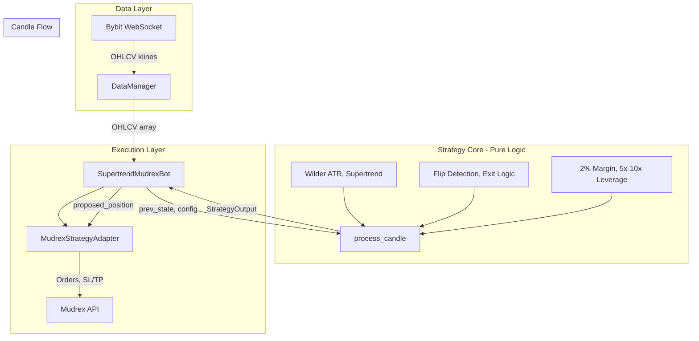
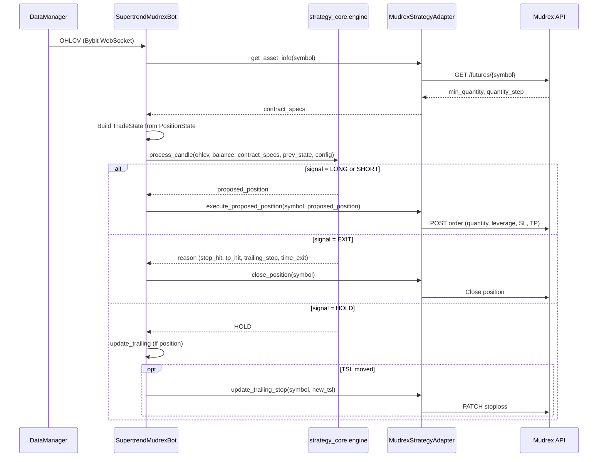
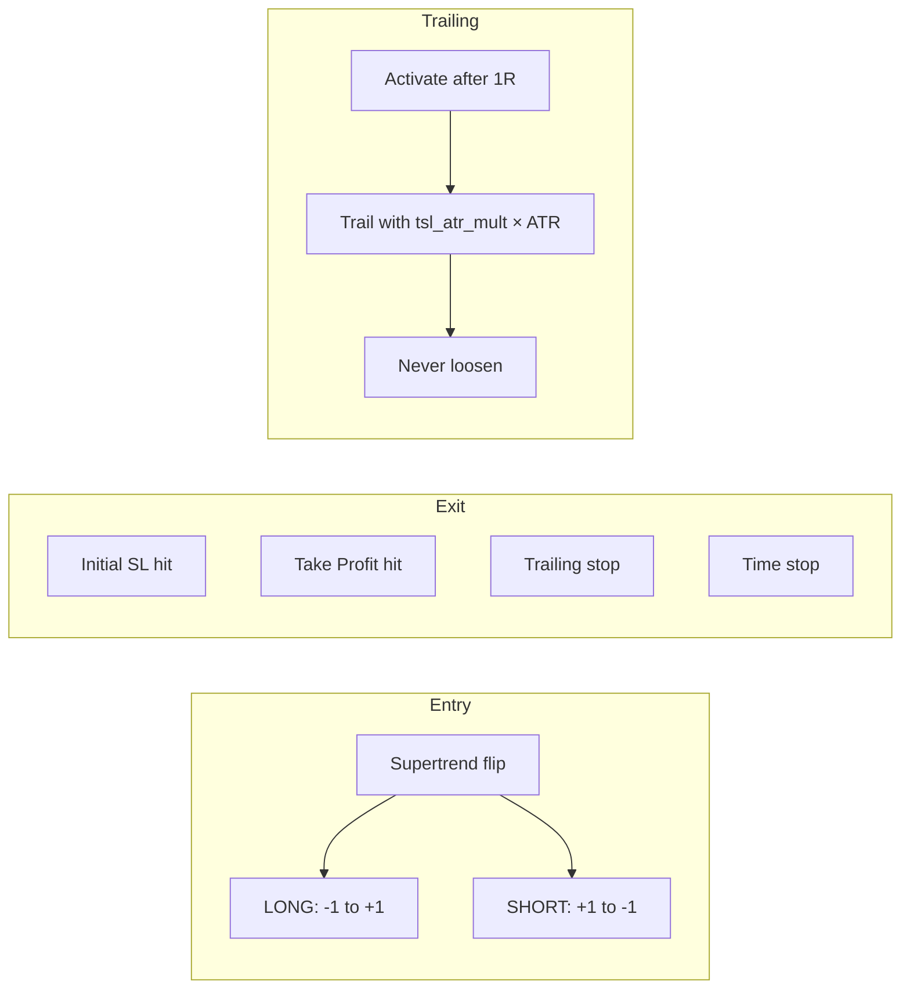

# Mudrex Supertrend ATR Strategy Bot

Production-safe Supertrend + ATR risk-managed strategy for Mudrex USDT-margined perpetual futures. Pure strategy logic with structured outputs consumed by the execution engine. OHLCV from Bybit WebSocket; orders via [Mudrex SDK](https://github.com/DecentralizedJM/mudrex-api-trading-python-sdk).

---

## Architecture



---

## Component Flow



---

## Strategy Configuration

| Parameter | Default | Description |
|-----------|---------|-------------|
| **Indicators** | | |
| ATR period | 10 | Wilder ATR (EMA-style smoothing) |
| Supertrend factor | 3.0 | Supertrend multiplier |
| **Risk** | | |
| Risk ATR mult | 2.0 | Stop distance = `risk_atr_mult × ATR` |
| TSL ATR mult | 2.0 | Trailing stop distance |
| Take profit RR | 2.0 | **1:2 Risk:Reward** |
| **Position sizing** | | |
| Margin per trade | 2% | `balance × 0.02` |
| Leverage | 5x min, 10x max | Configurable range |
| **Exits** | | |
| Time stop | 24 candles | Exit if neither TP nor SL hit |
| **Data** | | |
| Timeframe | 5m | Bybit kline interval |
| Lookback | 200 | Candles to maintain |

---

## Entry & Exit Logic



- **Entry**: Supertrend flips only; closed candle confirmation; no flip = no trade
- **Initial SL**: `risk_atr_mult × ATR` from entry
- **TP**: `RR × stop_distance` (1:2 default)
- **Trailing**: Activates when price reaches 1R; trails with `tsl_atr_mult × ATR`; never loosens
- **Time stop**: Exit after `max_bars_in_trade` candles

---

## Output Contract (Strategy Core)

On every candle close, `process_candle` returns:

```json
{
  "signal": "LONG | SHORT | HOLD | EXIT",
  "reason": "supertrend_flip | stop_hit | tp_hit | trailing_stop | time_exit",
  "proposed_position": {
    "side": "LONG | SHORT",
    "quantity": 0.001,
    "leverage": 5,
    "entry_price": 100000.0,
    "stop_loss": 99000.0,
    "take_profit": 102000.0
  }
}
```

`proposed_position` populated only when `signal` is LONG or SHORT.

---

## Environment Variables

| Variable | Required | Description |
|----------|----------|-------------|
| `MUDREX_API_SECRET` | **YES** | Mudrex API Secret |
| `TRADING_DRY_RUN` | No | `true` for testing (default: `false`) |
| `TELEGRAM_BOT_TOKEN` | No | Telegram bot token (from @BotFather) |
| `TELEGRAM_CHAT_ID` | No | Telegram chat ID (from @userinfobot). Notifications disabled if not set. |

---

## Deploy to Railway

1. **Fork/Clone** this repo.
2. **Create New Project** on Railway from GitHub.
3. **Add Variables**: `MUDREX_API_SECRET`
4. **Persistent State**: Add Volume, mount at `/app/data`

See [RAILWAY_GUIDE.md](RAILWAY_GUIDE.md) for details.

---

## Project Structure

```
strategy_core/           # Pure strategy logic (no Mudrex, no WebSocket)
├── indicators.py        # Wilder ATR, Supertrend
├── signals.py           # Entry/exit signal logic
├── risk.py              # Position sizing (2% margin, 5–10x leverage)
├── state.py             # TradeState
├── engine.py            # process_candle()
└── config.py            # StrategyConfig

mudrex_adapter.py        # Bridge to Mudrex SDK (orders, positions, TSL)
telegram_notifier.py     # Telegram notifications (open, close, PnL, cycle summary)
supertrend_mudrex_bot.py # Orchestrator (DataManager → strategy_core → adapter)
data_manager.py          # Bybit WebSocket OHLCV
config.py                # App config
```

---

## Safety Constraints

- Never open a new trade if a position is already active
- Never reverse in the same candle (flip only after exit)
- All calculations deterministic (no randomness)
- No look-ahead bias (closed-candle signals only)
